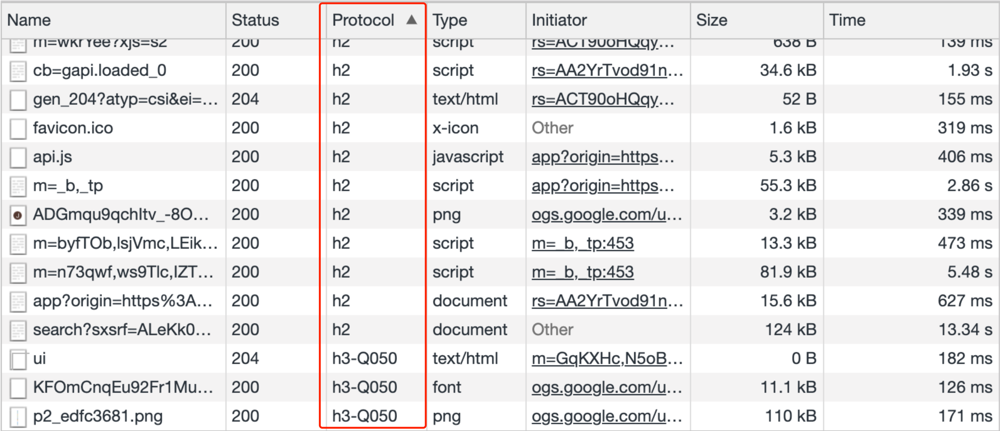
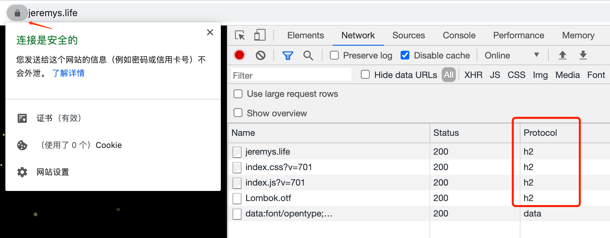

# 网站升级（一）：支持HTTPS

2020就要过完了，发现自己一篇文章没写。最近对网站和博客做了一些改动升级，决定趁周末水几篇文章。

第一个升级是网站支持 https 访问了，记录一下。


## 为什么要升级HTTPS

### 一、安全问题
说到升级 HTTPS，就要先说一下 HTTP 存在的安全问题：
- 通信使用明文（不加密），内容可能会被窃听
- 不验证通信方的身份，有可能遭遇伪装
- 无法证明报文的完整性，有可能以遭篡改

> 以上内容来自《图解HTTP》

针对这些问题，HTTPS使用SSL（Secure Socket Layer）提供了加密、认证、完整性保护功能。


因为HTTP存在的问题，浏览器表现为对HTTP请求的限制越来越严格，比如在chrome下：
1. HTTP站点的地址栏会有叹号标记，并显示「不安全」；
2. 一些 API 只能在安全环境下（Security Context）使用，比如 Geolocation 等。而HTTPS是安全环境的前提；
3. 正在逐步限制混合内容（Mixed Content，即HTTPS站点下的HTTP资源）的加载、下载。

关于第2个问题，我从MDN复制了一段使用 Geolocation API 的代码放到HTTP站点下执行，控制台会显示：
```text
[Deprecation] getCurrentPosition() and watchPosition() no longer work on insecure origins. To use this feature, you should consider switching your application to a secure origin, such as HTTPS. See https://goo.gl/rStTGz for more details.
```

关于第3个问题，我试了一下在HTTPS站点下加载HTTP图片，目前（chrome87）的行为是自动升级成HTTPS请求，并在控制台显示：
```text
Mixed Content: The page at 'https://jeremys.life/' was loaded over HTTPS, but requested an insecure element 'http://dict.youdao.com/pureimage'. This request was automatically upgraded to HTTPS, For more information see https://blog.chromium.org/2019/10/no-more-mixed-messages-about-https.html
```

### 二、HTTP/2
除了安全问题，另外还有一个重要原因就是HTTP/2 必须基于 HTTPS 部署。

HTTP/2 提供了多路复用、服务端推送等强大的功能。其实HTTP/2已经很普及了，打开 `https://google.com`随便搜索一个关键字，会发现几乎所有的HTTP请求都是基于HTTP/2的，剩下的一些请求也不是基于HTTP/1.1，而是HTTP/3…




## 如何升级

### 一、生成证书

证书使用了 [Let's Encrypt](https://letsencrypt.org/)的免费证书。使用 [certbot-auto](https://github.com/certbot/certbot/blob/master/certbot-auto)可以很方便的在服务器签发证书。网上的教程比较多，这里就只简单记录一下生成过程。

1.安装执行`certbot-auto`：
```bash
$ wget https://dl.eff.org/certbot-auto

$ chmod a+x certbot-auto

$ sudo ./certbot-auto certonly -d jeremys.life --manual --preferred-challenges dns --server https://acme-v02.api.letsencrypt.org/directoryf
```

2.添加txt解析记录
执行`certbot-auto`后会有一些列的Y/N选择，最后会提示：
```text
Please deploy a DNS TXT record under the name
_acme-challenge.jeremys.life with the following value:

MlRUgCrKK4CbTA5b2sHz7DOiIzasmMNaGqlxT2bvdRk

Before continuing, verify the record is deployed.
```
那就按照提示添加一条主机记录为`_acme-challenge`、值为`MlRUgCrKK4CbTA5b2sHz7DOiIzasmMNaGqlxT2bvdRk`的TXT解析记录。

可以使用`nslookup`检查添加的记录有没有生效：
```bash
$ nslookup -type=TXT _acme-challenge.jeremys.life
```
成功的话会输出：
```text
Non-authoritative answer:
_acme-challenge.jeremys.life	text = "MlRUgCrKK4CbTA5b2sHz7DOiIzasmMNaGqlxT2bvdRk"
```

3.完成
解析记录添加好后，回车一下就会提示生成成功：
```text
IMPORTANT NOTES:
 - Congratulations! Your certificate and chain have been saved at:
   /etc/letsencrypt/live/jeremys.life/fullchain.pem
   Your key file has been saved at:
   /etc/letsencrypt/live/jeremys.life/privkey.pem
   Your cert will expire on 2021-02-24. To obtain a new or tweaked
   version of this certificate in the future, simply run certbot-auto
   again. To non-interactively renew *all* of your certificates, run
   "certbot-auto renew"
 - Your account credentials have been saved in your Certbot
   configuration directory at /etc/letsencrypt. You should make a
   secure backup of this folder now. This configuration directory will
   also contain certificates and private keys obtained by Certbot so
   making regular backups of this folder is ideal.
 - If you like Certbot, please consider supporting our work by:

   Donating to ISRG / Let's Encrypt:   https://letsencrypt.org/donate
   Donating to EFF:                    https://eff.org/donate-le
```

### 二、配置nginx
这里贴出相关的配置：
```text
server {
  listen 80;
  server_name jeremys.life;
  add_header Strict-Transport-Security "max-age=63072000; includeSubdomains";
  return 301 https://$server_name$request_uri;
}

server {
  listen 443 ssl http2;
  server_name jeremys.life;

  ssl_certificate /etc/letsencrypt/live/jeremys.life-0001/fullchain.pem;
  ssl_certificate_key /etc/letsencrypt/live/jeremys.life-0001/privkey.pem;
  ssl_trusted_certificate /etc/letsencrypt/live/jeremys.life-0001/fullchain.pem;

  ...
}
```

主要做了以下几件事情：
1.通过设置`Strict-Transport-Security`（[HSTS](https://developer.mozilla.org/en-US/docs/Web/HTTP/Headers/Strict-Transport-Security)）和301重定向，保证用户访问http站点时会重定向到https站点。如果响应头中包含HSTS，那么之后再通过http访问站点时，不需要经过服务器301，浏览器就会自动通过https访问站点。关于HSTS，还有一个`preload`参数，如果指定了这个参数，而且站点在chrome的preload列表（需要满足一定条件后申请加入）中，那么首次http访问站点也会自动走https。
2.开启ssl（HTTPS）、HTTP/2
3.设置证书目录

重启nginx，访问站点，就已经发现HTTPS和HTTP/2都已经成功启用。



### 三、站内HTTP请求修改
最后因为前面提到的浏览器对于 Mixed Content 的限制，我们还要留意站内是不是还有一些HTTP请求，如果有的话就需要修改成HTTPS请求。


## 参考资料
- [关于启用 HTTPS 的一些经验分享](https://imququ.com/post/sth-about-switch-to-https.html)以及博主一系列关于HTTPS、HTTP/2的文章
- [阮一峰HTTPS升级指南](http://www.ruanyifeng.com/blog/2016/08/migrate-from-http-to-https.html)
- 《图解HTTP》HTTPS、HTTP/2相关章节
- [MDN Strict-Transport-Security](https://developer.mozilla.org/en-US/docs/Web/HTTP/Headers/Strict-Transport-Security)
- [MDN Mixed Content](https://developer.mozilla.org/en-US/docs/Web/Security/Mixed_content)