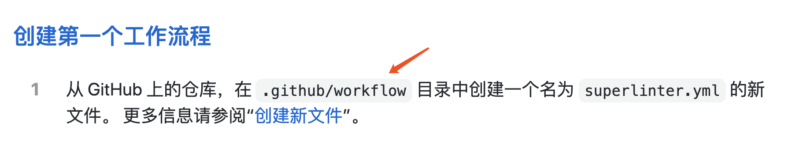
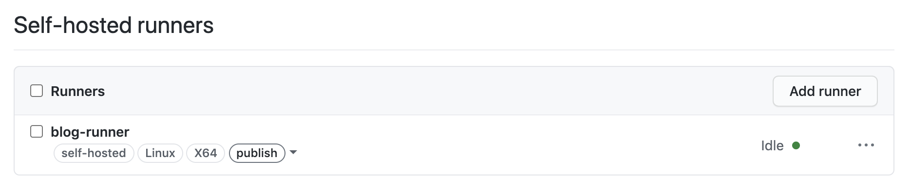
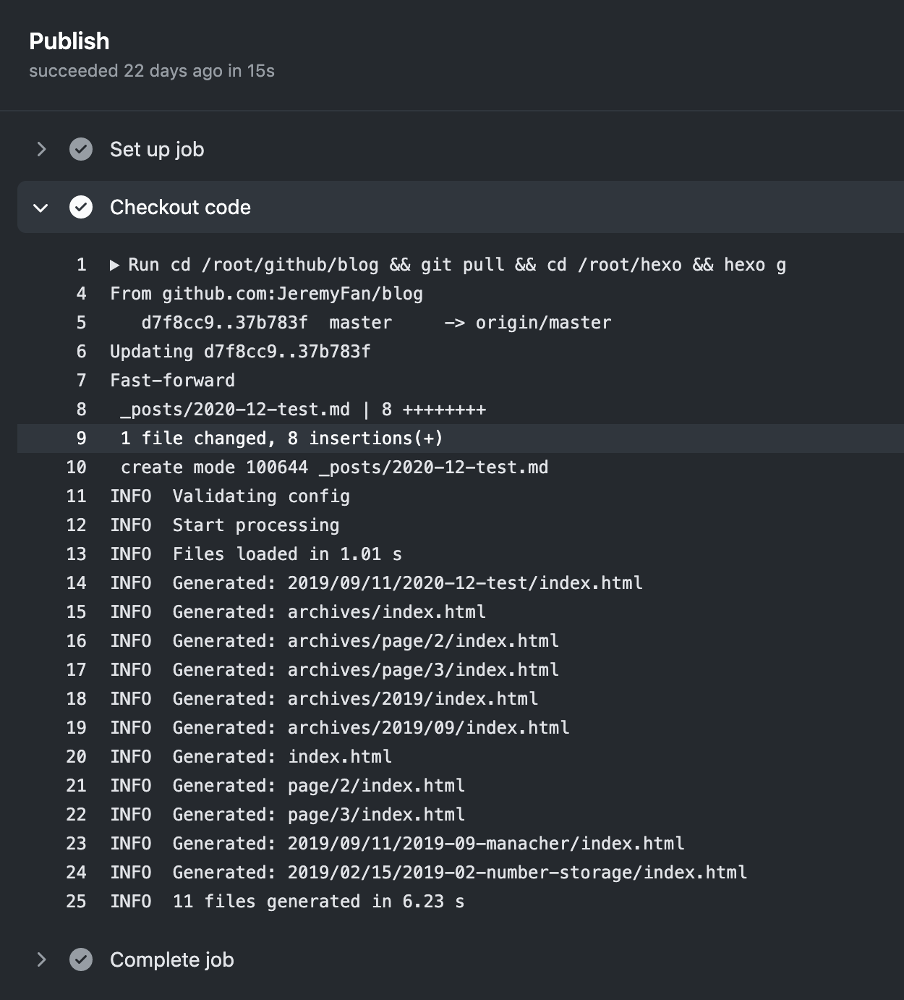

# 网站升级（二）：接入 Github Actions

之前网站一直在使用 Travis CI。
2018年10月，Github 也推出了自己的 CI 服务——Github Actions，决定试一试。

## 为什么需要CI

我的博客是基于 Hexo 的，部署在 vps 上，文章本身是 .md 文件，存放在 github。所以之前的发布流程是：
1. 写完文章，提交到 github
2. 登上 vps， 从 github 上拉取新文章
3. 通过 hexo 把文章编译成 html


2，3两步发布流程是完全可以做到自动化。对于项目而言，CI 的过程可以简单理解成代码提交后，通过一台机器执行单元测试、编译打包、部署等一系列发布流程。对于我的博客而言，CI 要做的就是从 github 拉取文章然后通过 hexo 编译成 html 文件。


## Travis CI 和 Gitlab CI

之前在公司接过 Gitlab CI，需要自备一台机器，在机器上为项目注册 gitlab-runner，每次提交代码就会触发这个 runner 执行脚本（构建、部署之类的）。

Travis CI 略有区别：
1. 不用手动安装注册运行 runner ，Travis 可以在页面关联好 github 的仓库
2. 不用自备机器，可以直接使用 Travis 的服务器执行脚本。相对来说，方便了一些。

## Github Actions

Github Actions 就很类似 Gitlab CI，可以直接使用 Github 的服务器作为编译机，也可以使用自己的机器。针对我的情况，使用自己的机器直接拉代码、编译会方便一些，不然在 Github 的服务器编译后还需要再把编译后的代码拷贝到自己的机器。

关于 Github Actions 的基础概念可以看阮老师的这篇[入门教程](http://www.ruanyifeng.com/blog/2019/09/getting-started-with-github-actions.html) 或官方的[文档](https://docs.github.com/en/free-pro-team@latest/actions/quickstart)，


## 接入过程

可以直接在仓库的 Actions 页面创建新 workflow，根据引导一步一步来就好了。

### 一、配置文件
和 Travis 一样，Actions 也需要一个 `.yml` 文件说明 CI 的配置。

先说明一下，Github Actions 可以配置一个或多个 workflow（工作流），每个 workflow 可以包含一个或多个 job（任务），每个 job 又由一个或多个 step 构成，每个 step 由执行一条或多条 action（动作）构成。

以我的博客为例：
```js
name: Publisher

on: 
  push:
    branches: [ master ]

jobs:
  publish:
    name: Publish
    runs-on: self-hosted
    steps:
      - name: Checkout code
        run: cd /root/github/blog && git pull && cd /root/hexo && hexo g
```

以上配置了一个名为 Publisher 的 workflow，包含一个名为 Publish 的任务（`runs-on: self-hosted`表示 Publish 任务跑在自己的机器上，这个后面会说明），Publish 任务只有一个 Checkout code 步骤，这个步骤的命令只有一个：`cd /root/github/blog && git pull && cd /root/hexo && hexo g`（更新仓库代码、编译文件）

另外`on: push: branches: [ master ]`表示任务只在往 master push 代码的时候执行。

就是这么简单，但因为任务需要在自己的机器上执行，还要在自己的机器上安装 Github Runner。

#### 一个小坑
`.yml`文件是放在`.github/workflows`下的。而[中文文档](https://docs.github.com/cn/free-pro-team@latest/actions/quickstart)写的是放在`.github/workflow`下：



我最开始按文档的操作死活都不行。后来在 Actions 页面直接创建才发现目录是 `.github/workflows`。看了下[英文文档](https://docs.github.com/en/free-pro-team@latest/actions/quickstart)确实也是`.github/workflows`，所以还是英文文档靠谱啊。


### 二、注册 actions runner

关于安装 runner，可以看官方的[这篇文章](https://docs.github.com/en/free-pro-team@latest/actions/hosting-your-own-runners/adding-self-hosted-runners)。

在 Settings -> Actions -> Add Runner 页面，有安装引导。简单来说分三步：
1.下载安装 runner
```bash
$ mkdir actions-runner && cd actions-runner
$ curl -O -L https://github.com/actions/runner/releases/download/v2.275.1/actions-runner-osx-x64-2.275.1.tar.gz
$ tar xzf ./actions-runner-osx-x64-2.275.1.tar.gz
```

2.注册 runner 并执行
```bash
$ ./config.sh --url https://github.com/JeremyFan/blog --token xxxxxx
$ ./run.sh
```

3.`.yml` 文件增加`runs-on: self-hosted`，表示使用自己的机器作为编译机。


#### 一个小问题
因为我都是直接root登机器，执行上面的脚本时会报错：
```bash
Must not run interactively with sudo
```
因为脚本有判断：
```bash
user_id=`id -u`
if [ $user_id -eq 0 -a -z "$RUNNER_ALLOW_RUNASROOT" ]; then
    echo "Must not run interactively with sudo"
    exit 1
fi
```
应该是为了保护用户的机器，但我还是注释掉了。


## OK 了

注册好后，我们会发现 runner 是 Idle 状态，表示 runner 已经成功配置，目前是闲置状态，当有任务执行时，状态会变为 Active。（还有一个状态是 Offline，比如 runner 没有成功运行，或其他配置有问题时会是这个状态。）




这样就实现了推文章自动发布的功能。在仓库的 Actions 页面可以看到相关的任务，也可以看到任务具体的内容：



