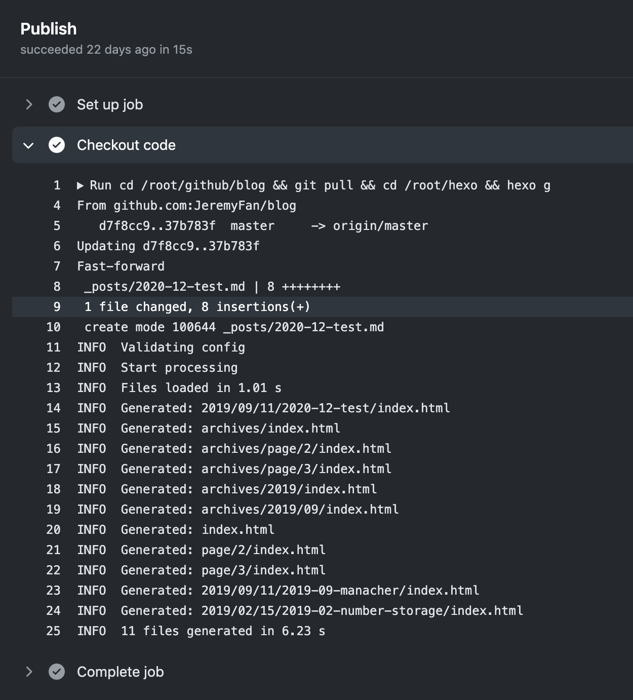

# 网站升级（三）：预编译博客文章内容


文章一般用 Markdown 写比较方便，Hexo 做的事情是把 Markdown 编译成 html。但每次我在用 Markdown 写完文章后，送给 Hexo 编译前，每次还要有点点小的改动，这次就把这些改动自动化。

## 为什么写完文章后还需要改动

我的文章是放在 github 仓库的，先来介绍下仓库的目录结构：

```text
.
├── _posts ····· Hexo使用的文章
├── _source ···· 原始文章
└── images ····· 文章用到的图片
```

写文章是在`_source`目录下，写好后再做一点改动放到`_posts`目录下供 Hexo 使用。

举个栗子，文章写完后是这样的：

```text
# 接入 Github Actions

2018年10月，Github 也推出了自己的 CI 服务——Github Actions

## 为什么需要CI
...



...
```

但其实 Hexo 需要的是这样的：

```text
---
title: 接入 Github Actions
date: 2020/12/26
---

2018年10月，Github 也推出了自己的 CI 服务——Github Actions

<!--more-->
...


...
```

一方面我想维持标准的 Markdown 格式（以便在其他地方展示），一方面 Hexo 需要一些特殊的格式。所以每次写完文章后都需要改动。

上面的栗子包含了所有的改动点：

第一个改动点是 Hexo 的标题和日期需要手动定义，所以需要加上 `title`、`date` 字段，加好之后就不再需要一级标题「# 接入 Github Actions」了，下面直接接上正文内容。

第二个改动点是 Hexo 摘要（即首页展示的部分文章内容）需要用`<!--more-->`标记，所以我要手动在合适的位置打标；

第三个改动点是关于图片路径的，本地使用相对路径`../images/actions.png`引用图片方便预览，但博客站点是部署在`https://jeremys.life/blog`下的，所以 Hexo 编译出的图片路径是`https://jeremys.life/blog/images/actions.png`，而如果继续使用相对路径，请求位置就变成了`https://jeremys.life/images/actions.png`，是请求不到的。当然这个问题也可以改ningx（把`/blog`下的图片请求转发到根目录）解决，但我觉得会有点奇怪。所以这里要把路径改为`/blog/images/actions.png`。

## 怎么改

如果由代码来完成这些改动，该怎么实现呢？

### 一、标题、日期

针对标题、日期，我需要做的就是把一级标题「# 接入 Github Actions」替换成

```text
---
title: 接入 Github Actions
date: 2020/12/26
---
```

`title`字段可以直接取`#`后面的内容；但文章里是没有日期信息的，我决定把日志完整的放在文件名中，之前因为排序方便查看，文章的命名也是带日期的，但只到月份，比如`2020-12-github-actions.md`，那么这次就需要统一命名为`2020-12-27-github-actions.md`。

这样`title`、`date`两个字段都有了，`---`是固定的内容不用去管它。

### 二、摘要

对于摘要，我的想法是把一级标题（`#`）和第一个二级标题（`##`）之间的内容视为摘要，这样也比较合理，一般一级标题后面也都是摘要、引子之类的文字，到二级标题开始正文。这样约定的话，只要想办法在第一个二级标题之前插入`<!--more-->`即可。

### 三、图片路径

解决图片路径问题的方法比较简单也比较暴力，因为要从`../images/actions.png`改为`/blog/images/actions.png`，直接把`../`替换成`/blog/`就好。

## 如何实现

正好前段时间在看编译原理，所以觉得这正是编译原理的使用场景，我需要把原始文章编译成抽象语法树（ast），然后去修改，修改完之后再编译回文章交给 Hexo。

所以大致是这样一个过程：

```text
article.md -> ast -> new ast -> hexo_article.md
```

但是把 Markdown 编译成 ast 以及把 ast 编译成 Markdown 这事儿我是不会做的，Markdown ast 的规范（不知道有没有统一的规范）我也不太想了解。这块肯定也有比较成熟的方案，我要做的就是操作原始文章的 ast，加工一下，修改为 Hexo 文章的 ast。

就像 babel 一样，js 编译成 ast 以及 ast 编译成 js 这些事儿都已经做好了，想实现什么，写 babel 插件就行。

（当然这个事情用字符串匹配替换也可以实现，但有一些细节要处理，比如`../`是不能直接全局替换的，要匹配到图片语法再替换避免误伤；以及不便应对未来可能出现的复杂场景，决定还是通过编译去实现）

于是我找到了[unified](https://github.com/unifiedjs/unified)，它是一个专门用语法树操作文本的库。有插件支持不同的文本格式，比如 [remark](https://github.com/remarkjs/remark) 用来处理 Markdown，[retext](https://github.com/retextjs/retext) 用来处理人类语言，[rehype](https://github.com/rehypejs/rehype) 用来处理 HTML等。

其实我只要用到 `remark-parse`、`remark-stringify` 这两个库就好了，`remark-parse` 是把 Markdown 编译成 ast，`remark-stringify` 是把 ast 编译成 Markdown。

所以整体的实现就是读文件，调用一个基于 `unified` 的 编译函数，把编译后的内容写到新文件。

编译函数大致的实现是这样：

```js
const unified = require('unified')
const Markdown = require('remark-parse')
const remarkStringify = require('remark-stringify')
const transformer = require('./transformer')

function compile(file, cb) {
  const { name, content } = file

  unified()
    // 把md转为ast
    .use(Markdown)
    // 使用transformer函数处理ast
    .use(transformer, { name })
    // 把新的ast转回md
    .use(remarkStringify)
    // content是文件内容
    .process(content, function (err, result) {
      cb && cb(result.contents)
    })
}
```

所以问题的关键是如何实现 transformer，transformer（或者叫 visitor）是编译相关的一个概念，它的作用就像它的名字一样，是接收老的 ast，操作需要转换的节点，组装成新的 ast 返回。如前文所述，需要操作的节点有三种：一级标题、第一个二级标题、图片。所以这个函数大概长这样：

```js
  function transformer(tree) {
    const result = {
      type: 'root',
      children: [],
      position: tree.position,
    }

    let current = 0;
    let node = null;

    while (current < tree.children.length) {
      node = tree.children[current]

      // 一级标题
      if (node.type === 'heading' && node.depth === 1) {
        // ...
      }
      // 二级标题
      if (node.type === 'heading' && node.depth === 2) {
        // ...
      }
      // 包含图片节点的段落
      if (node.type === 'paragraph' && node.children && node.children.find(item => item.type === 'image')) {
        // ...
      }

      result.children.push(node)
      current++
    }
    return result
  }
```

### 处理一级标题

一级标题的处理比较简单，找到然后返回新的节点就可以。有个小细节是新节点要用到日期，`unified`使用 transformer 时把文件名传进去了（`.use(transformer, { name })`），截取一下日期就可以。

```js
if (node.type === 'heading' && node.depth === 1) {
  node = {
    type: 'paragraph',
    children: [{
      type: 'text',
      value: `---\ntitle: ${node.children[0].value}\ndate: ${matchedDate}\n---\n`
    }]
  }
}
```

### 处理二级标题

二级标题的处理也有个小细节，因为只需处理第一个二级标题，所以需要一个标记变量。

```js
if (node.type === 'heading' && node.depth === 2) {
  if (!meetFirstSubHeading) {
    result.children.push({
      type: 'paragraph',
      children: [{
        type: 'html',
        value: `<!--more-->`
      }]
    })

    meetFirstSubHeading = true
  }
}
```

### 处理图片

图片都是包裹在段落里的，所以其实是处理子节点中包含图片的段落，然后直接替换路径就可以。

```js
if (node.type === 'paragraph' && node.children && node.children.find(item => item.type === 'image')) {
  node.children = node.children.map(item => {
    if (item.type === 'image') {
      if (item.url.indexOf('../') > -1) {
        item.url = item.url.replace('\.\.\/', '/blog\/')
      }
    }
    return item
  })
}
```

这样一级标题、二级标题、图片都处理完成了，完整代码在[这里](https://github.com/JeremyFan/blog/blob/master/compiler/index.js)。
